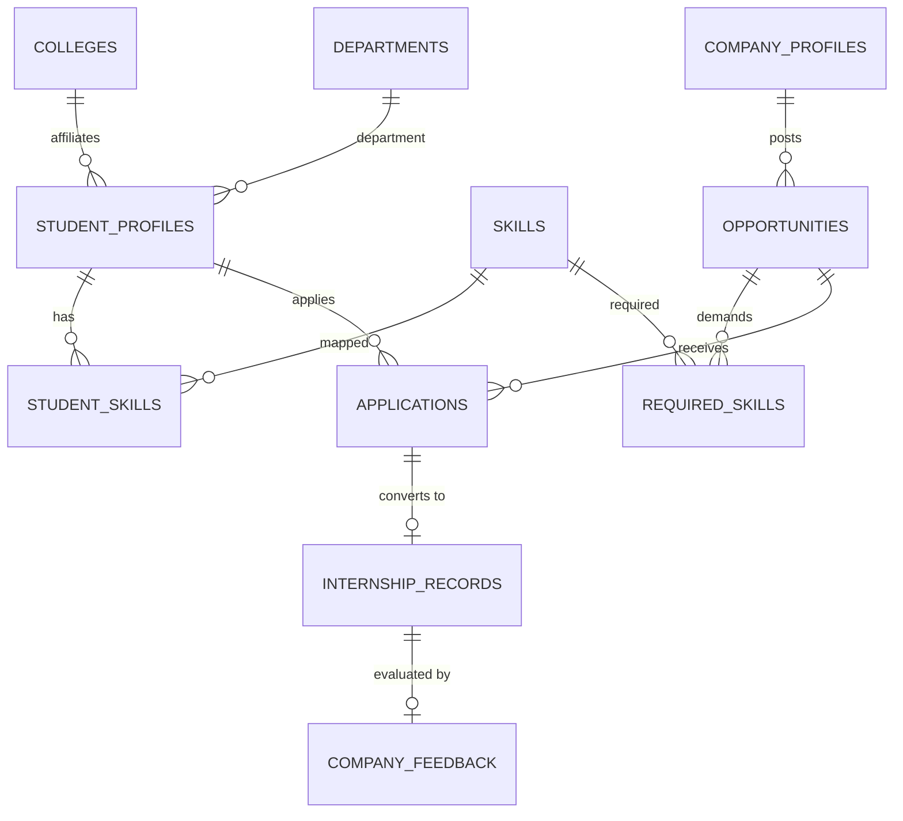

# SkillBridge — Demo Credentials & Seed Data Reference

This document contains credentials and details for all seeded demonstration accounts across the **Admin**, **College**, **Company**, and **Student** portals for project review and testing.

---

## 1. Demo User Accounts & Login Credentials

### Admin Account
| Role | Portal / Name | Email | Password |
| :--- | :--- | :--- | :--- |
| **ADMIN** | SkillBridge Administrator | `admin@skillbridge.org` | `Admin@SkillBridge2026!` |

---

### College Accounts (Institutions)
| Role | Institution Name | Location | Login Email | Password |
| :--- | :--- | :--- | :--- | :--- |
| **COLLEGE** | Indian Institute of Technology Hyderabad | Sangareddy, Telangana | `dean.placement@iith.ac.in` | `IITH@Placement2026` |
| **COLLEGE** | Indian Institute of Technology Madras | Chennai, Tamil Nadu | `placements@iitm.ac.in` | `IITM@Placement2026` |
| **COLLEGE** | National Institute of Technology Warangal | Warangal, Telangana | `tpo@nitw.ac.in` | `NITW@Placement2026` |
| **COLLEGE** | International Institute of Information Technology Hyderabad | Hyderabad, Telangana | `placement.cell@iiit.ac.in` | `IIITH@Placement2026` |
| **COLLEGE** | Vellore Institute of Technology | Vellore, Tamil Nadu | `pat@vit.ac.in` | `VIT@Placement2026` |

---

### Company Accounts (Corporate Recruiters)
| Role | Company Name | Industry | Login Email | Password |
| :--- | :--- | :--- | :--- | :--- |
| **COMPANY** | Microsoft | Cloud & Enterprise Software | `campus.recruitment@microsoft.com` | `MSFT@Hire2026!` |
| **COMPANY** | Google | Internet Services, AI & Software | `university.hiring@google.com` | `GOOG@Hire2026!` |
| **COMPANY** | Amazon | E-Commerce, AWS Cloud & Logistics | `student.programs@amazon.com` | `AMZN@Hire2026!` |
| **COMPANY** | Deloitte | Consulting & Technology Advisory | `campus.talent@deloitte.com` | `DELO@Hire2026!` |
| **COMPANY** | Accenture | IT Services & Global Consulting | `entrylevel.hiring@accenture.com` | `ACCN@Hire2026!` |
| **COMPANY** | IBM | Hybrid Cloud & Cognitive AI | `university.relations@ibm.com` | `IBMC@Hire2026!` |
| **COMPANY** | Oracle | Cloud Infrastructure & Database Systems | `campus.recruiting@oracle.com` | `ORCL@Hire2026!` |

---

### Student Accounts
| Role | Student Name | Roll No | Branch | Year | College | Phone | Login Email | Password |
| :--- | :--- | :--- | :--- | :--- | :--- | :--- | :--- | :--- |
| **STUDENT** | Konakanchi Venkata Lakshmi Vangnaini | 2400030137 | CSE | Y24 (Yr 2) | IIT Hyderabad | 9492076004 | `vangnaini.k@iith.ac.in` | `Skill@Vangnaini2026` |
| **STUDENT** | Singuparapu Lalith Aditya | 2400031810 | CSE | Y24 (Yr 2) | IIT Madras | 8341647137 | `lalith.aditya@iitm.ac.in` | `Skill@Lalith2026` |
| **STUDENT** | Maddi James | 2400040114 | ECE | Y24 (Yr 2) | NIT Warangal | 6309353927 | `james.maddi@nitw.ac.in` | `Skill@James2026` |
| **STUDENT** | Prajwal AR | 2400090198 | CS & IT | Y24 (Yr 2) | IIIT Hyderabad | 9019722495 | `prajwal.ar@iiit.ac.in` | `Skill@Prajwal2026` |
| **STUDENT** | Munaga Naga Sai Janaki | 2400030142 | CSE | Y24 (Yr 2) | VIT Vellore | 8309526728 | `sai.janaki@vit.ac.in` | `Skill@Janaki2026` |
| **STUDENT** | Manné Thavitha sree ramani | 2400090023 | CS & IT | Y24 (Yr 2) | IIT Hyderabad | 8008934324 | `thavitha.manne@iith.ac.in` | `Skill@Thavitha2026` |

---

## 2. Seeded Data Architecture & Relationship Summary

### Skills Distribution per Student
1. **Konakanchi Venkata Lakshmi Vangnaini**: Java, SQL, Spring Boot, Git, REST APIs
2. **Singuparapu Lalith Aditya**: Java, Python, React, SQL, Git, Data Structures & Algorithms, Docker
3. **Maddi James**: Python, Machine Learning, SQL, Git, REST APIs
4. **Prajwal AR**: JavaScript, React, Node.js, SQL, Git, HTML/CSS
5. **Munaga Naga Sai Janaki**: Python, Java, Data Structures & Algorithms, PostgreSQL, Spring Boot
6. **Manné Thavitha sree ramani**: JavaScript, React, Python, REST APIs, Git, HTML/CSS

---

## 3. Seeded Opportunities & Skill-Match Matrix

| Company | Opportunity Title | Type | Mode | Min CGPA | Required Skills | Eligible Depts |
| :--- | :--- | :--- | :--- | :--- | :--- | :--- |
| **Microsoft** | Software Engineering Intern | INTERNSHIP | HYBRID | 8.50 | Java, DSA, Spring Boot, Git | CSE, CSIT |
| **Google** | Software Engineer Intern - Systems & Core | INTERNSHIP | HYBRID | 8.75 | Python, Java, DSA, Git | CSE, CSIT |
| **Amazon** | Software Development Engineer Intern | INTERNSHIP | ONSITE | 8.00 | Java, AWS, REST APIs, SQL | CSE, CSIT, ECE |
| **Deloitte** | Technology Analyst Intern - Enterprise Solutions | INTERNSHIP | ONSITE | 7.50 | SQL, Python, REST APIs | CSE, CSIT, ECE, EEE |
| **Accenture** | Associate Software Engineer - Frontend | PLACEMENT | HYBRID | 7.00 | JavaScript, React, HTML/CSS, Git | CSE, CSIT, ECE |
| **IBM** | AI / Machine Learning Research Intern | INTERNSHIP | REMOTE | 8.20 | Python, ML, SQL, REST APIs | CSE, CSIT, AIDS, ECE |
| **Oracle** | Cloud Infrastructure & Database Intern | INTERNSHIP | ONSITE | 8.00 | Java, PostgreSQL, Docker, Linux | CSE, CSIT |
| **Microsoft** | Full Stack Web Developer Intern | INTERNSHIP | REMOTE | 8.00 | JavaScript, React, Node.js, SQL, Git | CSE, CSIT |

---

## 4. How to Execute the Seed Data on Supabase

1. Open your **[Supabase Dashboard](https://supabase.com/dashboard)**.
2. Select your SkillBridge project database.
3. Open the **SQL Editor** from the left navigation menu.
4. Open the SQL file: [`apps/api/src/main/resources/db/seed/V3__seed_demo_data.sql`](file:///e:/LALITH%20PROJECTS/SIH%202026%20-%20PS044/SkillBridge/skillbridge/apps/api/src/main/resources/db/seed/V3__seed_demo_data.sql).
5. Copy and paste the entire script into the Supabase SQL editor and click **Run**.
6. All seed records will be inserted safely and idempotently without breaking any existing records or table constraints.
